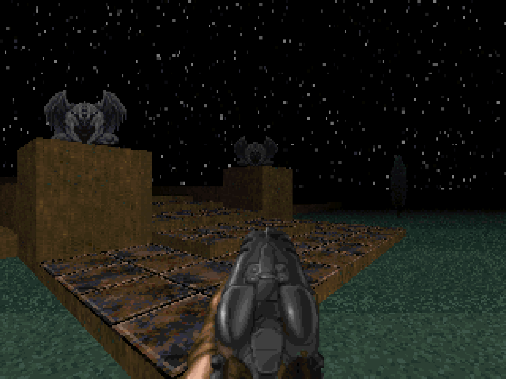

# Rvnic Raven

# Building

1. Get a compiler: I recommend gcc but clang works too.

2. Install the SDL2 and SDL2_mixer development files:

   On Debian/Ubuntu: sudo apt install libsdl2-dev libsdl2-mixer-dev

3. Clone this repository: ``git clone https://github.com/Captain4LK/RvnicRaven-ray.git``

4. Compile RvR_all.c, just keep the generated object file (.o) in the root directory of this repository: 
   ``gcc -c src/RvR_all.c -std=c99 -Wall -Wextra -Wshadow -pedantic -O3 -flto``
   Windows mingw cross compile:
   ``i686-w64-mingw32-gcc -c src/RvR_all.c -std=c99 -Wall -Wextra -Wshadow -pedantic -O3 -flto``
   ``x86_64-w64-mingw32-gcc -c src/RvR_all.c -std=c99 -Wall -Wextra -Wshadow -pedantic -O3 -flto``
   Emscripten:
   ``emcc -c src/RvR_all.c -std=c99 -Wall -Wextra -Wshadow -pedantic -O3 -flto -s USE_SDL=2``

# Building the example games

1. cd into the directory of the example, eg: ``cd games/RvnicRaven-ray``

2. Build the example (you may need to change the location of the RvR_all.o file depending on where you stored it):
   ``gcc -o ../../bin/RvnicRaven *.c ../../RvR_all.o -std=c99 -Wall -Wextra -Wshadow -pedantic -O3 -flto=auto -s -lSDL2 -lSDL2_mixer``
   Windows mingw cross compile:
   ``i686-w64-mingw32-gcci686-w64-mingw32-gcc -o ../../bin/RvnicRaven *.c ../../RvR_all.o -std=c99 -Wall -Wextra -Wshadow -pedantic -O3 -flto=auto -s -lmingw32 -lSDL2main -lSDL2 -lSDL2_mixer -mwindows``

3. You can now run the example from the bin directory

# Credits (code)

Rvnic Raven incorporates code from multiple different sources. Here is a list of them, with license and file specified. The files itself contain additional notes about the source.

* Crack dot Com (Golgotha, Abuse), for
   * memory allocator (RvR_malloc.c), public domain
* Mattias Gustavsson, for
   * rnd.h (RvR_rand.c), unlicense/mit
* [r-lyeh](https://github.com/r-lyeh), for
   * tinyini (RvR_config.c), public domain
   * pak.c (RvR_pak.c), public domain
   * crush.c (RvR_compress.c), public domain
* [RandyGaul](https://github.com/RandyGaul), for
   * cute_path (RvR_pak.c), unlicense/zlib
* [Miloslav Číž](https://gitlab.com/drummyfish), for
   * raycastlib (RvR_raycast.c, RvR_raycast_draw.c), CC0
* [Landon Curt Noll](http://www.isthe.com/chongo/index.html), Glenn Fowler, Phong Vo, for
   * Fowler/Noll/Vo hash (RvR_hash.c), public domain

# License

All code in this repository (unless marked otherwise, see above for potential exceptions) is released into the public domain (CC0), see COPYING for more info.

# Gallery

# Links

