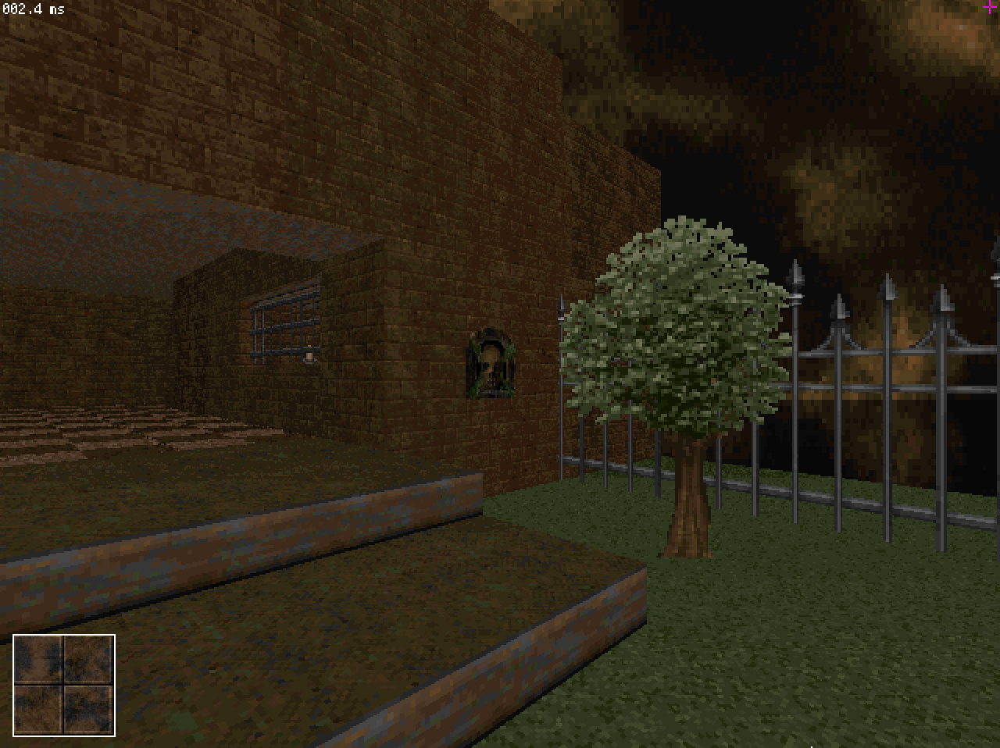

# Rvnic Raven

# Building from source

1. Get a compiler: I recommend gcc but clang works too.
2. Compile and install SoftLK-lib: https://github.com/Captain4LK/SoftLK-lib
3. Clone this repository: ``https://github.com/Captain4LK/RvnicRaven-ray``
4. Compile, the binary can be found in the bin/ directory: 
```
cd bin/[OS]
make -j 4
```
5. Get the assets, download data.zip from here: https://github.com/Captain4LK/RvnicRaven-ray/releases/ and unpack it.
6. Place the data directory in bin/ so that the path to main.json is: ``bin/data/main.json``

* First, clone this repository: ``https://github.com/Captain4LK/RvnicRaven-ray``

* Rvnic Raven requires SoftLK-lib, instructions for compilling it can be found in its repository: https://github.com/Captain4LK/SoftLK-lib

# Credits (code)

Rvnic Raven incorporates code from multiple different sources. Here is a list of them, with license and file specified. The files itself contain additional notes about the source.

* Crack dot Com, for
   * memory allocator (RvR_malloc.c), public domain
   * random number generator (RvR_rand.c), public domain
* [r-lyeh](https://github.com/r-lyeh), for
   * tinyini (RvR_config.c), public domain
   * tinyjson5 (RvR_pak.c), public domain
   * pak.c (RvR_pak.c), public domain
   * crush.c (RvR_compress.c), public domain
* [RandyGaul](https://github.com/RandyGaul), for
   * cute_path (RvR_pak.c), unlicense/zlib
* [Miloslav Číž](https://gitlab.com/drummyfish), for
   * raycastlib (RvR_raycast.c, RvR_raycast_draw.c), CC0

# License

All code in this repository (unless clearly marked otherwise, see above for potential exceptions) is released into the public domain (CC0), see COPYING for more info.

# Gallery



# Links
<a href="https://discord.gg/Nch8hjdZ2V"></a>
